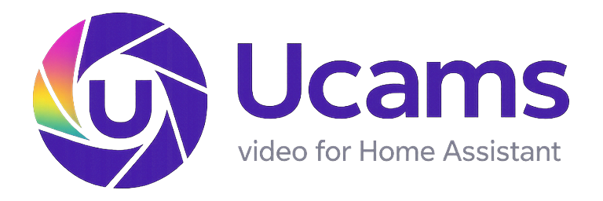

<div align="center">



# Ucams для Home Assistant

**Неофициальная интеграция видеонаблюдения и домофонов Уфанет (Ufanet) для Home Assistant.**

[](https://github.com/hacs/integration)
[](LICENSE)
[](https://github.com/Muxee4ka/ucams_home_assistant/actions/workflows/test.yml)
[](https://github.com/Muxee4ka/ucams_home_assistant/actions/workflows/validate.yml)
[](https://github.com/Muxee4ka/ucams_home_assistant/releases/latest)

</div>

---

Подключает камеры с `dom.ufanet.ru` и `cams.ufanet.ru` к Home Assistant: живой RTSP-поток, скриншоты, архив записей, открытие домофона, история звонков и геолокация камер на карте. Авторизация — по номеру договора и паролю от личного кабинета.

## Что умеет

- **Камеры** — живой RTSP-поток, WebRTC через Flussonic, снапшоты по запросу.
- **Изображения** — превью камер с автообновлением (интервал настраивается).
- **Домофоны** — открытие двери одной кнопкой (momentary switch с автоотключением).
- **Звонки в домофон** — event «Звонок» и sensor последнего звонка по каждому домофону. По умолчанию опрос истории раз в 30 секунд; с включёнными push-уведомлениями событие приходит примерно через секунду после звонка.
- **Архив записей** — кнопки на 5 минут / 1 час / 5 часов и сервис `ucams.get_archive` с произвольным окном.
- **Снапшоты** — сервис `ucams.snapshot` с фолбэком на placeholder, если RTSP-кадр не получен.
- **Городские камеры** — публичные камеры Уфанет («Городские камеры» в приложении) можно добавить по поиску и радиусу от дома. Только live, без архива.
- **Геолокация** — камеры с координатами появляются на HA-карте значком камеры (свои — синим, городские — серым); расстояние до дома считается автоматически.
- **Биллинг** — sensor'ы с информацией о договорах и подключённых услугах.
- **Авто-области** — устройства группируются по адресу (улица + дом) и автоматически привязываются к area.

## Установка

### Через HACS (рекомендуется)

1. HACS → **Интеграции** → **⋮** → **Пользовательские репозитории**
2. URL: `https://github.com/Muxee4ka/ucams_home_assistant`, категория **Integration**
3. Найти **Ucams** в списке и установить
4. Перезапустить Home Assistant

### Вручную

Скопировать папку `custom_components/ucams` из [latest release](https://github.com/Muxee4ka/ucams_home_assistant/releases/latest) в `<config>/custom_components/` и перезапустить HA.

## Настройка

[Настройки](https://my.home-assistant.io/redirect/config) → **Устройства и службы** → [**Добавить интеграцию**](https://my.home-assistant.io/redirect/config_flow_start?domain=ucams) → найти **Ucams**.

[](https://my.home-assistant.io/redirect/config_flow_start?domain=ucams)

| Поле | Что вводить |
|---|---|
| **Название** | Любое имя для интеграции (по умолчанию `Ucams`) |
| **Dom URL** | `https://dom.ufanet.ru` (для большинства регионов) |
| **Username** | Номер договора |
| **Password** | Пароль от личного кабинета |
| **Refresh interval** | Период обновления превью изображений в секундах (по умолчанию 600) |
| **Добавить городские камеры** | Включает публичные городские камеры Уфанет (по умолчанию выключено) |
| **Городские камеры: поиск** | Строка поиска по названию камеры или адресу, например `Нижний Новгород` или `Сенная`. Пусто — без текстового фильтра |
| **Городские камеры: радиус** | Радиус от координат HA в километрах (по умолчанию 5, `0` — без фильтра по расстоянию) |
| **Push-уведомления о звонках** | Мгновенные события о звонках в домофон (по умолчанию выключено, см. ниже) |

### Городские камеры

Уфанет публикует ~2000 городских камер по всем городам присутствия. Фильтры
применяются вместе: поиск отрабатывает на стороне API, радиус — локально по
координатам камеры. Если не задать ни того, ни другого, интеграция возьмёт
100 ближайших камер и напишет об этом в лог.

У городских камер нет архива — API не выдаёт для них токен записи, поэтому
кнопки архива и сенсор ссылки для них не создаются. Всё остальное работает:
поток, превью, `ucams.snapshot`, точка на карте.

### Push-уведомления о звонках

У Уфанета нет webhook'а для звонков — приложение «Умный дом» узнаёт о них
через Firebase Cloud Messaging. С этой опцией интеграция делает то же самое:
регистрирует Home Assistant как ещё одно устройство аккаунта и держит
соединение с Google. По пушу она сразу перечитывает историю звонков, так что
event «Звонок» срабатывает примерно через секунду, а не через 0–30. Опрос
раз в 30 секунд остаётся страховкой на случай потерянного пуша.

Что нужно знать:

- В приложении Уфанет в списке активных устройств появится **Home Assistant**.
  Если завершить эту сессию из приложения («Завершить остальные сессии»),
  интеграция потеряет авторизацию: вход по договору и паролю восстановится
  сам, вход по звонку придётся пройти заново.
- Выключение опции на аккаунте с паролем снимает устройство с аккаунта. На
  аккаунте со входом по звонку устройство остаётся — снятие отзывает токен
  самой интеграции, и без пароля войти обратно она не сможет. Удалить
  интеграцию целиком можно в любом случае, устройство тогда снимается.
- Нужен исходящий доступ к `mtalk.google.com:5228`. У части российских
  провайдеров это соединение рвётся каждые 20 секунд — интеграция
  переподключается за полсекунды, пуши за это время не теряются.

### Уведомления о звонке на телефон

Для этого есть готовый blueprint: уведомление со снимком с камеры, номером
квартиры и кнопкой «Открыть дверь». Нужно приложение
[Home Assistant Companion](https://companion.home-assistant.io/) на телефоне.

[](https://my.home-assistant.io/redirect/blueprint_import/?blueprint_url=https%3A%2F%2Fgithub.com%2FMuxee4ka%2Fucams_home_assistant%2Fblob%2Fmaster%2Fblueprints%2Fautomation%2Fucams%2Fintercom_call_notification.yaml)

1. В настройках интеграции включите **Push-уведомления о звонках** — без них
   уведомление тоже придёт, но с задержкой до 30 секунд.
2. Нажмите кнопку выше и импортируйте blueprint.
3. Создайте по нему автоматизацию: выберите домофон («Звонок …»), его камеру,
   выключатель двери (если нужна кнопка «Открыть дверь») и свой телефон.

На несколько домофонов — по автоматизации на каждый.


## Сущности и сервисы

После добавления интеграции на каждую камеру/домофон создаётся набор сущностей:

| Платформа | Что появляется |
|---|---|
| `camera` | RTSP-поток камеры |
| `image` | Превью с автообновлением |
| `switch` | Кнопка открытия домофона (только для интеркомов) |
| `sensor` | Время последнего звонка, ссылка на архив, данные о договорах и услугах |
| `event` | «Звонок» — срабатывает на каждый новый звонок в домофон (тип `ring`) |
| `button` | Архив за 5 мин / 1 ч / 5 ч |
| `geo_location` | Камера на карте (если есть координаты) |

Городские камеры получают только `camera`, `image` и `geo_location` — архива у них нет.

### Сервисы

#### `ucams.snapshot`
Сохранить кадр с камеры в файл. При сбое RTSP кладёт placeholder, чтобы автоматизации не падали.

```yaml
service: ucams.snapshot
data:
  entity_id: camera.ucams_kamera_1
  filename: www/kamera_1.jpg   # опционально, по умолчанию /config/www/ucams_snapshots/<slug>_<ts>.jpg
```

#### `ucams.get_archive`
Получить ссылку на архивную запись. Записывает результат в соответствующий `sensor.archive_link_*`.

```yaml
service: ucams.get_archive
data:
  entity_id: camera.ucams_kamera_1
  start_time: "{{ now() - timedelta(hours=1) }}"   # datetime или unix timestamp
  duration: "01:00:00"                              # HH:MM:SS или секунды (int)
```

> До 1 часа архив отдаётся в `.mp4`, дольше — в `.ts`.

## Примеры автоматизаций

<details>
<summary><b>Снимок раз в сутки</b></summary>

```yaml
alias: Сделать снимок камеры 1
trigger:
  - platform: time
    at: "01:00:00"
action:
  - service: ucams.snapshot
    data:
      entity_id: camera.ucams_kamera_1
      filename: www/kamera_1.jpg
```

</details>

<details>
<summary><b>Архив за последний час в Telegram</b></summary>

```yaml
alias: "Архив за последний час в Telegram"
trigger:
  - platform: time_pattern
    minutes: "0"
action:
  - service: ucams.get_archive
    data:
      entity_id: camera.ucams_kamera_1
      start_time: "{{ now() - timedelta(hours=1) }}"
      duration: "01:00:00"
  - delay:
      seconds: 10
  - service: telegram_bot.send_message
    data:
      target:
        - "<your_telegram_chat_id>"
      message: >-
        Архив за последний час:
        [Открыть]({{ state_attr('sensor.archive_link_kamera16_3podezd_kryltso', 'archive_url') }})
mode: single
```

</details>


## Поддержка

- **Баги и идеи** — [Issues](https://github.com/Muxee4ka/ucams_home_assistant/issues)
- **Код-ревью / контрибы** — PR в `master` приветствуются, CI прогонит ruff + pytest на 3.12 и 3.13 + hassfest + HACS
- **Telegram автора** — см. профиль [@Muxee4ka](https://github.com/Muxee4ka)

## Лицензия

[MIT](LICENSE) — используйте, форкайте, модифицируйте.

## Star History

[](https://star-history.com/#Muxee4ka/ucams_home_assistant&Timeline)
